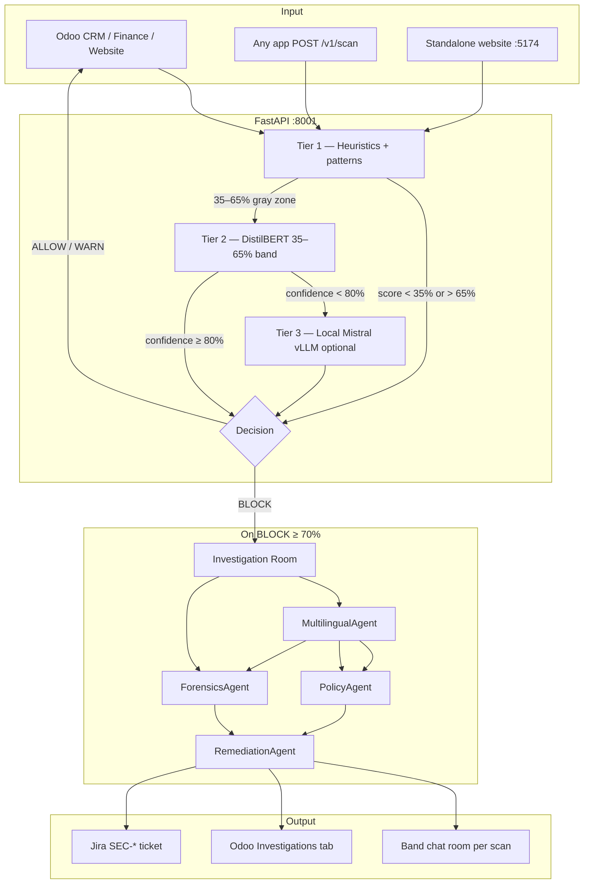
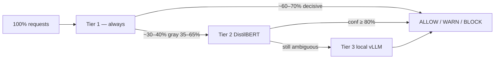
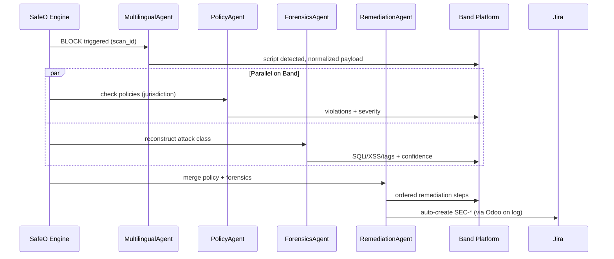

# SafeO

**Multi-agent cybersecurity investigation for enterprise apps** — built for the [Band of Agents Hackathon](https://lablab.ai) (Track 3: Regulated & High-Stakes Workflows).

SafeO scores every input **0–100** and returns **ALLOW / WARN / BLOCK** before data hits your database. On **BLOCK** (risk ≥ **70%**), four specialized agents collaborate through **Band** with real task handoffs and shared context. Scoring runs on **tiered on-prem ML** — **$0 OpenAI** on the default path. High-risk events auto-escalate to **Jira**. Live demo in **Odoo**; one REST API plugs into **any system**.

---

## At a glance

| Metric | Value |
|--------|-------|
| Band agents | **4** (Multilingual, Policy, Forensics, Remediation) |
| ML tiers | **3** (heuristics → DistilBERT → local Mistral) |
| Requests skipping Tier 3 | **~70–85%** (design target; measure via `/ml/tier-stats`) |
| Cloud LLM API cost (default) | **$0** |
| Decision latency (Tier 1 path) | **&lt;50 ms** typical |
| BLOCK threshold | **≥ 70%** risk score |
| WARN threshold | **40–69%** |
| Investigation agents run in parallel | **2** (Policy + Forensics) |
| Jira auto-ticket on BLOCK | **Yes** (when configured in Odoo Settings) |
| Supported scripts | Latin, Arabic, Urdu, Arabizi, mixed |

---

## Hackathon alignment

| Requirement | How SafeO delivers |
|-------------|-------------------|
| **3+ agents on Band** | **4** agents — each registered on [band.ai](https://band.ai) with its own API key and handle |
| **Meaningful Band usage** | Investigation Room opens on every BLOCK; Policy + Forensics post **in parallel** to the same Band room tagged with `scan_id` |
| **Enterprise workflow** | Block → 4-agent investigation (~3–8 s) → remediation plan → **Jira SEC-\*** ticket |
| **Regulated / high-stakes** | Policy jurisdiction checks, full audit trail, human analyst in loop, no external LLM by default |
| **Cross-framework** | FastAPI + Band SDK + universal `/v1/scan` — Odoo is the demo, not the lock-in |

---

## System flow



---

## Tiered ML pipeline (no OpenAI default)

SafeO uses a **funnel** — expensive inference only when cheaper tiers cannot decide.



| Tier | Engine | When it runs | Latency | Cloud API? |
|------|--------|--------------|---------|------------|
| **1** | Regex, entropy, n-grams, behavioral signals | **Every** request | ~10–50 ms | **No** |
| **2** | DistilBERT classifier (CPU/GPU) | Risk score in **35–65%** band | ~50–200 ms | **No** |
| **3** | Mistral-7B via local vLLM | Tier 2 confidence **&lt; 80%** and vLLM up | ~1–3 s | **No** — self-hosted |

**Blend rule (Tier 2):** when confident, final score = **40%** Tier 1 + **60%** Tier 2.

**Extra signals layered on all tiers:**
- **Behavioral risk** — repeat probes, odd-hour activity (+5–15% boost)
- **Drift detection** — flags when attack patterns shift vs 7-day baseline
- **Multilingual normalization** — AraBERT-class model; Urdu/Arabic/Arabizi evasion stripped before pattern scan

Check live split: `GET /ml/tier-stats` or `/ml/full-stats`

---

## Band multi-agent investigation

Band is the **collaboration layer** — not a notification at the end. When SafeO returns **BLOCK**, `investigation_room.py` orchestrates four agents and mirrors every step to Band via `band_bridge.py`.



### The four Band agents

| Agent | Job | Band role |
|-------|-----|-----------|
| **MultilingualAgent** | Detect script (Latin/Arabic/Urdu/mixed), normalize text, flag evasion | Runs **first** — all downstream agents read normalized payload |
| **PolicyAgent** | Map input to compliance rules (UAE PDPL, GDPR-style, internal SEC) | Runs **in parallel** with Forensics |
| **ForensicsAgent** | Classify attack (SQLi, XSS, prompt injection, path traversal) | Runs **in parallel** with Policy |
| **RemediationAgent** | Produce ops checklist: block IP, rotate creds, notify CISO, open ticket | Runs **last** after both parallel agents finish |

Each message includes: `scan_id`, severity (`info` / `warning` / `critical` / `done`), and JSON metadata. A dedicated Band chat room is created per investigation (`task_id = scan_id`).

**Setup:** create 4 external agents at [band.ai](https://band.ai) → copy IDs/keys to `backend/.env` → `BAND_ENABLED=true`. Promo: **BANDHACK26**

**Without Band:** set `BAND_ENABLED=false` — WebSocket + Odoo Investigations tab still show the full agent log.

---

## Jira escalation

When a **BLOCK** is logged in Odoo (risk ≥ **70%**):

| Field | Value |
|-------|-------|
| Issue type | Bug / Security |
| Priority | High |
| Summary | `[SafeO] High-risk threat — {module}` |
| Body | Risk %, decision, user, timestamp, truncated payload, patterns, AI explanation |
| Project | `SEC` (configurable) |

Configure in **Odoo → Settings → SafeO → Jira Integration** (URL, email, API token, project key). Dashboard **Risk → Action** panel shows live ticket ID + link.

---

## Key features

- **4 Band agents** with parallel Policy + Forensics and sequential handoffs
- **3-tier on-prem ML** — heuristics, DistilBERT, optional local Mistral; **0** OpenAI API calls by default
- **Multilingual evasion** — mixed-script SQLi/XSS caught after normalization
- **Universal `/v1/scan`** — same engine for Odoo, Jira comments, Salesforce, custom apps
- **Odoo OWL dashboard** — Live Feed, Sandbox, Investigations (WebSocket), Jira panel
- **Standalone website** — `:5174` status + connect demo
- **Python SDK** — `safeo_sdk/python/client.py`

---

## Project structure

```
├── README.md                 # You are here
├── .env.example              # Band, Jira, LLM, API keys
├── QUICKSTART.md             # GPU, vLLM, Band, smoke tests
├── odoo.conf.example
│
├── backend/                  # FastAPI (:8001)
│   └── safeo_backend/
│       ├── agents/           # investigation_room, band_bridge, policy, forensics…
│       ├── core/ml/          # tiered_llm, risk_scorer, tier2_classifier
│       └── routers/ws.py     # live agent WebSocket
│
├── odoo_module/securec_odoo/ # Odoo 19 add-on — main demo UI
├── safeo_website/            # Vite + React (:5174)
├── safeo_sdk/python/         # /v1/scan client
├── docs/
│   └── ARCHITECTURE.md
└── scripts/run_all.sh
```

---

## Quick start (3 terminals)

### 1. Backend — port 8001 (required)

```bash
cd backend
python3.11 -m venv .venv
source .venv/bin/activate
pip install -r requirements.txt
cp ../.env.example .env          # fill Band + optional vars
export PYTHONPATH="$(pwd)"
uvicorn safeo_backend.main:app --host 127.0.0.1 --port 8001 --reload
```

| URL | Purpose |
|-----|---------|
| http://127.0.0.1:8001/docs | Swagger |
| http://127.0.0.1:8001/v1/health | `band_enabled`, `band_agents_connected` (Bearer: `internal`) |
| http://127.0.0.1:8001/ml/tier-stats | Tier 1/2/3 usage split |

### 2. Odoo — port 8069 (main demo UI)

1. Copy `odoo.conf.example` → your Odoo dir as `odoo.conf`
2. Set `addons_path` → include `/path/to/this-repo/odoo_module`
3. `./venv/bin/python odoo-bin -c odoo.conf --http-port=8069`
4. Install **SafeO — ERP Risk Decision Engine** (`securec_odoo`)
5. **Settings → SafeO** → API URL = `http://127.0.0.1:8001`
6. **Settings → SafeO → Jira** → URL, email, token, project `SEC`

| URL | Purpose |
|-----|---------|
| http://127.0.0.1:8069/odoo/safeo | SafeO dashboard |
| **SafeO ERP → Business Risk Dashboard** | Sandbox · Investigations · Jira |

> **“You are offline”** in browser = Odoo not running on 8069.

### 3. Website — port 5174 (optional)

```bash
cd safeo_website && npm install && npm run dev
```

Open http://localhost:5174

---

## Environment variables

Copy `.env.example` → `backend/.env`:

| Variable | Purpose |
|----------|---------|
| `BAND_MULTILINGUAL_*` | Band agent ID + API key |
| `BAND_POLICY_*` | Band agent ID + API key |
| `BAND_FORENSICS_*` | Band agent ID + API key |
| `BAND_REMEDIATION_*` | Band agent ID + API key |
| `BAND_ENABLED` | `true` / `false` |
| `SAFEO_API_KEYS` | Bearer tokens for `/v1/*` |
| `SAFEO_LLM_*` | Local vLLM — Tier 3 only |
| `JIRA_*` | Reference; live config in Odoo Settings |

---

## Demo flow (3 minutes)

| Step | Action | Expected |
|------|--------|----------|
| 1 | Clean text in Sandbox | ALLOW · ~5–15% · no agents |
| 2 | `' OR 1=1; DROP TABLE users; --` | BLOCK · ≥85% · 4 agents · ~3–8 s |
| 3 | Investigations tab | Live agent log + Band mirror |
| 4 | Risk → Action panel | Jira SEC-* fields |
| 5 | Urdu + Latin mixed payload | MultilingualAgent flags evasion |
| 6 | `/ml/tier-stats` | Tier 1 dominates · Tier 3 ≈ 0 |

---

## API smoke test

```bash
curl -s -X POST http://127.0.0.1:8001/v1/scan \
  -H "Authorization: Bearer internal" \
  -H "Content-Type: application/json" \
  -d '{"input":"'\'' OR 1=1--","context":{"source_system":"odoo","user_id":"demo"}}' \
  | python3 -m json.tool
```

Expected: `"decision": "BLOCK"`, `"risk_score_pct": 85+`, `"tier_used": 1`, `"scan_id": "..."`

---

## Business impact (illustrative)

| Before SafeO | With SafeO |
|--------------|--------------|
| ~45 min manual triage per incident | ~3 min automated investigation |
| Breach detection: industry avg **204 days** | Block at **save time** (seconds) |
| Scattered logs, no agent context | Band room + Odoo trail + Jira ticket |
| Cloud LLM cost per request | **$0** default (on-prem tiers) |

---

## Team

**Shreeya Gupta** — Band of Agents Hackathon · [lablab.ai](https://lablab.ai)

---

## License

[LICENSE](LICENSE)
