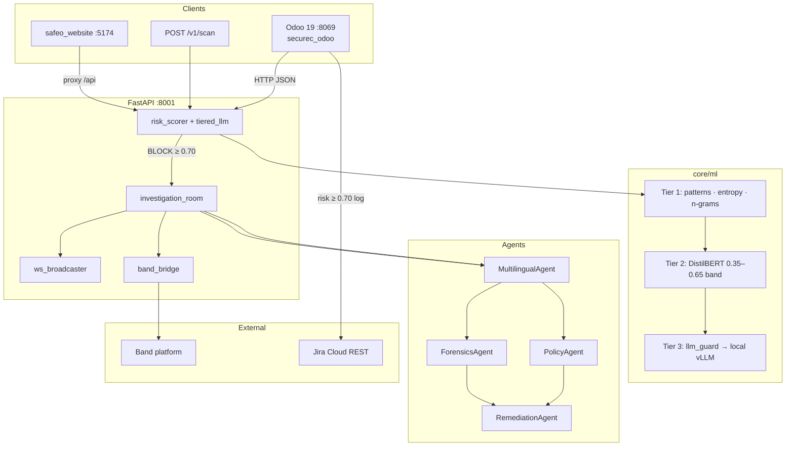
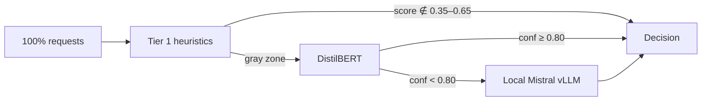

# SafeO

**Cross-framework multi-agent security decision engine** for enterprise input validation and incident investigation.

Submitted to the [Band of Agents Hackathon](https://lablab.ai) · **Track 3: Regulated & High-Stakes Workflows**

SafeO intercepts untrusted text at application boundaries (ERP forms, REST payloads, website inputs), computes a calibrated risk score, and enforces **ALLOW / WARN / BLOCK** before persistence. On **BLOCK**, an async **Investigation Room** coordinates four domain agents through **Band** — with parallel policy/forensics analysis, structured context handoff, WebSocket replay, and optional **Jira** escalation.

**Design constraint:** scoring and investigation run on **self-hosted inference** (heuristics + DistilBERT + optional local Mistral via vLLM). No OpenAI or commercial LLM API is required on the default path.

---

## Problem

Enterprise applications accept high-entropy user input across CRM, finance, HR, and public-facing forms. Perimeter WAFs lack business context; post-hoc SIEM review happens after data is already committed. Security teams need:

1. **Inline decisions** at write time with explainable scores  
2. **Multi-agent triage** that mirrors SOC workflows (normalize → policy + forensics → remediate)  
3. **Auditable handoffs** across tools (Band for agents, Jira for humans)  
4. **Deployable inference** without routing sensitive payloads to third-party LLM APIs  

SafeO addresses this as a FastAPI microservice with ERP-native enforcement (Odoo 19 demo) and a framework-agnostic `/v1/scan` contract.

---

## Technical summary

| Dimension | Implementation |
|-----------|----------------|
| **Runtime** | Python 3.11 · FastAPI 0.115 · Uvicorn |
| **Band integration** | `band-sdk` · `AsyncRestClient` · per-agent REST clients · chat room per `scan_id` |
| **ML stack** | 3-tier funnel: heuristics → DistilBERT → local Mistral-7B (vLLM) |
| **Multilingual** | Script detection + normalization (Latin, Arabic, Urdu, Arabizi, mixed) before pattern matching |
| **Agent orchestration** | `asyncio.gather` for parallel agents · `agent_post()` fan-out to WebSocket + Band |
| **ERP demo** | Odoo 19 OWL module (`securec_odoo`) · `ir.http` request hook · no core patches |
| **Real-time UI** | WebSocket `/ws/investigation/{scan_id}` · 200-msg ring buffer per investigation |
| **Ticketing** | Jira REST API v3 via Odoo `securec_log._try_create_jira_ticket()` |
| **Auth** | Bearer middleware on `/v1/*` · token `internal` always valid for Odoo proxy |

---

## Architecture



### Request lifecycle

1. **Ingress** — Odoo controller or `/v1/scan` receives `{ input, context }`.  
2. **Tier 0 signals** — `behavioral_risk_score()`, drift/temporal metadata attached.  
3. **Tier 1** — `calculate_risk_score()`: regex corpus, Shannon entropy, structural features, multilingual normalization.  
4. **Tier routing** — `run_tiered_scoring()` in `tiered_llm.py`:  
   - Score **&lt; 0.35** or **&gt; 0.65** → Tier 1 decisive (no neural model)  
   - Score **0.35–0.65** → Tier 2 DistilBERT; blend **0.4·T1 + 0.6·T2** when confidence **≥ 0.80**  
   - Else → Tier 3 local vLLM if `is_llm_available()`  
5. **Decision mapping** — `risk_score ≥ 0.70` → **BLOCK** · `0.40–0.69` → **WARN** · else **ALLOW**  
6. **Investigation** — on BLOCK, `asyncio.create_task(run_investigation())` — scan response is not blocked.  
7. **Egress** — Odoo enforces BLOCK on ORM save; API returns JSON; agents publish to WS + Band.

---

## Band multi-agent layer

Band is the **coordination bus** between investigation agents — not a post-hoc notification channel.

### Orchestration (`investigation_room.py`)

```
MultilingualAgent  (sequential, provides normalised_text)
        │
        ├──────────────────┬──────────────────┐
        ▼                  ▼                  │
   PolicyAgent        ForensicsAgent     asyncio.gather
        │                  │                  │
        └────────┬─────────┘                  │
                 ▼                            │
          RemediationAgent  (sequential, merges both outputs)
```

- `agent_post()` is **awaited** at each step so WebSocket buffer is populated before the investigation record is persisted (late-join clients get full replay).  
- `band_bridge.band_post()` is fired via `asyncio.create_task` — Band latency never blocks the investigation pipeline.  
- Band failures are swallowed; SafeO degrades to WebSocket + REST investigation API.

### Band REST integration (`band_bridge.py`)

| Step | API | Notes |
|------|-----|-------|
| Auth | `agent_api_identity.get_agent_me()` | Validates each agent API key on startup |
| Room | `agent_api_chats.create_agent_chat(task_id=scan_id)` | One room per investigation |
| Message | `agent_api_messages.create_agent_chat_message()` | Structured markdown + JSON metadata appendix |
| Timeout | 3–5 s per call | `asyncio.wait_for`; silent fallback |

Four external agents registered on [band.ai](https://band.ai), each with independent `BAND_{AGENT}_AGENT_ID` and `BAND_{AGENT}_API_KEY`. Config template in `.env.example`. Promo: **BANDHACK26**.

### Agent responsibilities

| Agent | Input | Output | Band handle |
|-------|-------|--------|-------------|
| **MultilingualAgent** | Raw payload | `script_detected`, `normalised`, `evasion_suspected`, `confidence` | SafeO-Multilingual |
| **PolicyAgent** | Normalised text + jurisdiction context | `policies_violated[]`, `severity` | SafeO-Policy |
| **ForensicsAgent** | Payload + matched patterns | Attack class, MITRE-style tags, confidence | SafeO-Forensics |
| **RemediationAgent** | Policy + forensics dicts | Ordered action list (block, notify, ticket) | SafeO-Remediation |

---

## ML pipeline



| Tier | Module | Trigger | Typical latency | External API |
|------|--------|---------|-----------------|--------------|
| 1 | `risk_scorer.py`, `keyword_detector.py`, `entropy.py`, `ngram_similarity.py` | Always | 10–50 ms | None |
| 2 | `tier2_classifier.py` (DistilBERT) | `0.35 ≤ score ≤ 0.65` | 50–200 ms | None |
| 3 | `llm_guard.py` → vLLM Mistral-7B | Tier 2 low confidence + vLLM reachable | 1–3 s | None (self-hosted) |

**Auxiliary models:**
- `multilingual_agent.py` — AraBERT-class encoder for Arabic/Urdu script; runs on Tier 1 path  
- `drift_detector.py` — rolling 7-day pattern distribution shift  
- `temporal_scorer.py` — off-hours / velocity anomaly boost (+0.05–0.15)  
- `retraining_loop.py` — SQLite feedback store from `/v1/feedback` for active learning  

**Observability:** `GET /ml/tier-stats`, `GET /ml/full-stats`, `GET /ml/drift-status`

Design target: **70–85%** of production traffic resolves without Tier 3 (validate on your workload via tier-stats).

---

## API surface

### Universal API (`/v1/*`) — Bearer auth required

| Method | Path | Description |
|--------|------|-------------|
| `POST` | `/v1/scan` | Single input scan → full decision payload + `scan_id` |
| `POST` | `/v1/scan/batch` | Up to 50 concurrent scans |
| `GET` | `/v1/health` | Component flags: GPU, vLLM, tier2, Band agent count |
| `POST` | `/v1/feedback` | Human verdict (`correct` / `false_positive` / `false_negative`) |

**Scan response fields:** `scan_id`, `risk_score`, `risk_score_pct`, `decision`, `tier_used`, `tier1_score`, `tier2_score`, `llm_score`, `matched_patterns[]`, `explanations[]`, `script_detected`, `behavioural_risk_score`

### ERP gates (`/erp/*`)

| Path | Gate |
|------|------|
| `/erp/crm/lead` | CRM lead text |
| `/erp/finance/action` | Payment / approval memos |
| `/erp/employee/activity` | HR activity strings |
| `/erp/transaction` | Generic transaction payload |
| `/erp/dashboard/summary` | Aggregated metrics for OWL UI |

### Investigations

| Method | Path | Description |
|--------|------|-------------|
| `GET` | `/investigations` | List recent investigations |
| `GET` | `/investigations/{scan_id}` | Detail + synthesized `agent_log[]` |
| `WS` | `/ws/investigation/{scan_id}` | Live agent message stream |

### Simulation

| Method | Path | Description |
|--------|------|-------------|
| `POST` | `/simulate/attack` | 18 curated payloads across 6 attack classes → `detection_rate` |

---

## Odoo integration (`securec_odoo`)

Odoo is the **reference deployment** for hackathon demo — not a hard dependency.

| Mechanism | File | Behavior |
|-----------|------|----------|
| Request interception | `ir_http_monitor.py` | Extends `ir.http`; inspects mutating POST bodies |
| CRM hook | `crm_lead.py` | Scores lead description before `create` |
| Decision log | `securec_log.py` | Persists ALLOW/WARN/BLOCK + triggers Jira on `risk_score ≥ 0.70` |
| Settings | `securec_settings.py` | API URL, module toggles, Jira credentials (`ir.config_parameter`) |
| Dashboard | `dashboard.js` + OWL XML | Live Feed, Sandbox, Investigations (WS), Risk→Action |

**Jira payload** (`securec_log._try_create_jira_ticket`): `POST {jira_url}/rest/api/3/issue` with Atlassian Document Format body — risk %, module, truncated input, patterns, explanation. Project key default `SEC`.

---

## Hackathon evaluation mapping

| Judging criterion | Evidence in SafeO |
|-------------------|-------------------|
| **Application of Technology** | 4 Band agents · parallel `asyncio.gather` · shared `scan_id` context · REST + WS dual publish |
| **Presentation** | Odoo Sandbox (live inject) · Investigations tab (agent timeline) · `/docs` Swagger · tier-stats JSON |
| **Business Value** | Pre-commit BLOCK · Jira work items · policy audit trail · regulated-workflow track fit |
| **Originality** | 3-tier on-prem ML funnel · multilingual evasion normalization · ERP-native + universal API |

| Band requirement | Status |
|------------------|--------|
| ≥ 3 agents collaborating through Band | **4 agents** |
| Collaboration through Band (not wrapper) | Investigation Room posts mid-workflow; Policy ∥ Forensics |
| Enterprise workflow | Block → investigate → remediate → Jira |
| Cross-framework | FastAPI agents + Band SDK; Odoo is one consumer |

---

## Repository layout

```
backend/safeo_backend/
├── main.py                    # ASGI entry, startup Band init
├── agents/
│   ├── investigation_room.py  # Multi-agent orchestrator
│   ├── band_bridge.py         # Band REST client layer
│   ├── multilingual_agent.py
│   ├── policy_agent.py
│   ├── forensics_agent.py
│   └── remediation_agent.py
├── core/ml/
│   ├── tiered_llm.py          # Tier routing logic
│   ├── risk_scorer.py         # Tier 1 engine
│   └── tier2_classifier.py    # DistilBERT
├── routes/
│   ├── universal.py           # /v1/scan
│   └── investigations.py
├── routers/ws.py              # WebSocket broadcaster
└── middleware/auth.py         # Bearer gate on /v1/*

odoo_module/securec_odoo/      # Odoo 19 addon (demo UI)
safeo_website/                 # Vite + React status dashboard
safeo_sdk/python/              # HTTP client wrapper
```

---

## Quick start

### Prerequisites

Python 3.11+ · Node 18+ · PostgreSQL 14+ · Odoo 19 (for ERP demo)

### 1. Backend (required)

```bash
cd backend
python3.11 -m venv .venv && source .venv/bin/activate
pip install -r requirements.txt
cp ../.env.example .env    # Band keys, API tokens, optional vLLM URL
export PYTHONPATH="$(pwd)"
uvicorn safeo_backend.main:app --host 127.0.0.1 --port 8001 --reload
```

Verify: `curl -H "Authorization: Bearer internal" http://127.0.0.1:8001/v1/health`

### 2. Odoo (demo UI)

```bash
# Copy odoo.conf.example → your Odoo install
# addons_path must include: /path/to/repo/odoo_module
./venv/bin/python odoo-bin -c odoo.conf --http-port=8069
```

Install `securec_odoo` · Settings → API URL `http://127.0.0.1:8001` · Jira credentials optional.

Dashboard: http://127.0.0.1:8069/odoo/safeo

### 3. Website (optional)

```bash
cd safeo_website && npm install && npm run dev
# http://localhost:5174
```

---

## Environment configuration

Copy `.env.example` → `backend/.env`:

```bash
# Band — 4 external agents (band.ai)
BAND_ENABLED=true
BAND_MULTILINGUAL_AGENT_ID=...
BAND_MULTILINGUAL_API_KEY=...
# ... POLICY, FORENSICS, REMEDIATION

# API auth
SAFEO_API_KEYS=internal

# Tier 3 — local vLLM only (optional)
SAFEO_LLM_SERVER_URL=http://localhost:8000/v1
SECUREC_ENABLE_LLM_AUGMENTATION=true

# Jira — configured in Odoo UI; vars in .env are reference defaults
JIRA_BASE_URL=https://yourorg.atlassian.net
JIRA_PROJECT_KEY=SEC
```

Set `BAND_ENABLED=false` to run without Band — investigation pipeline and WebSocket replay remain functional.

---

## Verification

```bash
# BLOCK — SQL injection (Tier 1 decisive)
curl -s -X POST http://127.0.0.1:8001/v1/scan \
  -H "Authorization: Bearer internal" \
  -H "Content-Type: application/json" \
  -d '{"input":"'\'' OR 1=1; DROP TABLE users;--","context":{"source_system":"api","user_id":"test"}}' \
  | python3 -m json.tool

# Batch simulation — detection rate across 18 payloads
curl -s -X POST http://127.0.0.1:8001/simulate/attack \
  -H "Content-Type: application/json" \
  -d '{}' | python3 -m json.tool

# Tier distribution
curl -s http://127.0.0.1:8001/ml/tier-stats | python3 -m json.tool
```

**Expected BLOCK response:** `decision: "BLOCK"`, `risk_score ≥ 0.70`, `tier_used: 1|2|3`, non-empty `scan_id`. Investigation agents fire asynchronously — poll `/investigations/{scan_id}` or connect WebSocket.

---

## Demo checklist 

| # | Action | Expected result |
|---|--------|-----------------|
| 1 | Clean CRM text in Odoo Sandbox | ALLOW · low score · no agents |
| 2 | `' OR 1=1; DROP TABLE users; --` | BLOCK · tier 1 · investigation starts |
| 3 | Investigations tab | 4-agent timeline · WebSocket replay |
| 4 | Band dashboard (if configured) | Parallel policy/forensics messages in room |
| 5 | Risk → Action panel | Jira SEC-* fields populated |
| 6 | Mixed Urdu/Latin payload | MultilingualAgent · `evasion_suspected: true` |
| 7 | `GET /ml/tier-stats` | Tier 3 call count ≈ 0 on CPU-only demo |

---

## Design decisions

| Decision | Rationale |
|----------|-----------|
| **Async investigation** | `create_task` on BLOCK — p99 scan latency unaffected by agent/Band RTT |
| **Tiered ML funnel** | Cost and privacy: heuristics resolve majority; LLM only on ambiguous band |
| **Band REST not Agent.create()** | Direct `AsyncRestClient` for external agents — explicit room/message control |
| **Dual publish (WS + Band)** | WS for Odoo UI replay; Band for hackathon cross-framework collaboration proof |
| **Odoo + /v1/scan** | ERP demo for judges; REST API for production integrators |
| **Fail-open Band** | Security path must not depend on third-party SaaS availability |

---

## Team

**Shreeya Gupta** — [lablab.ai](https://lablab.ai) · Band of Agents Hackathon 2026

---

## License

[LICENSE](LICENSE)
